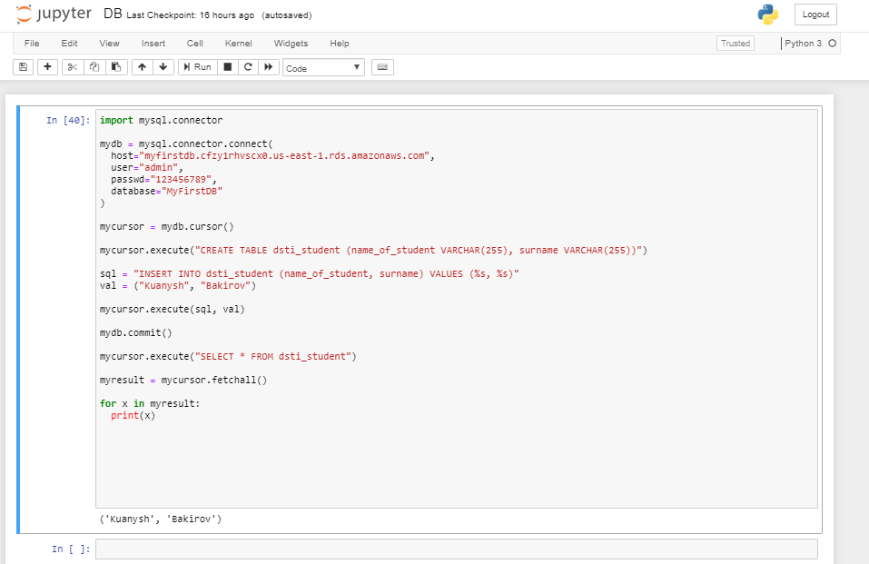

# Access AWS Database by Python
In this project we are going to use Python to access, create table and print values.
This is going to done in 2 main steps.

## **1 step. Creating Database on AWS**
 We choose RDS *(Relational Database Service)* in Services page

 

Then Button **Create database**. We will click on **Standard Create**.
In this project we use **MySQL** engine.

 

### **Edition** and **version** of MySQL we leave as default.

### Very important to choose **Free tier** template.  

  

### In **Settings** following properties are very essential:
   - **Endpoint** (this is the hostname)
   - **Port** (by default 3306)
   - **Database name** (ebdb)
   - **Username**
   - **Password**

### These configurations we are going to use to access our Database on Python.

## **2 step. Using Python(Jupyter Notebook)**

In Jupyter Terminal we need to install mysql-connector:

`conda install -c anaconda mysql-connector-python`

Then in our Jupyter Notebook we import my-sql-connector and set properties of Database:

```
import mysql.connector

mydb = mysql.connector.connect(
  host="myfirstdb.cfzy1rhvscx0.us-east-1.rds.amazonaws.com",
  user="admin",
  passwd="123456789",
  database="MyFirstDB"
)
```
Then I have created table called **dsti_student** with two columns **name_of_student** and **surname**. Script below:

```
mycursor = mydb.cursor()

mycursor.execute("CREATE TABLE dsti_student (name_of_student VARCHAR(255), surname VARCHAR(255))")
```

Next step is to insert data in this table:

```
sql = "INSERT INTO dsti_student (name_of_student, surname) VALUES (%s, %s)"
val = ("Kuanysh", "Bakirov")

mycursor.execute(sql, val)

mydb.commit()
```

Last step is to display values of table **dsti_student**:

```
mycursor.execute("SELECT * FROM dsti_student")

myresult = mycursor.fetchall()

for x in myresult:
  print(x)
```

## And we have printed values of our table


