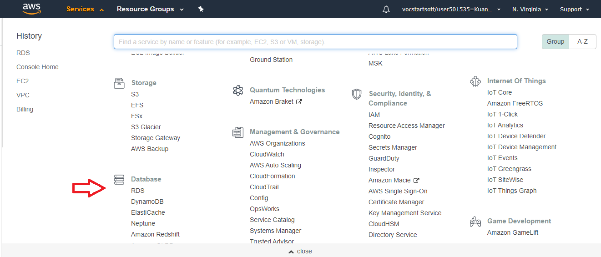
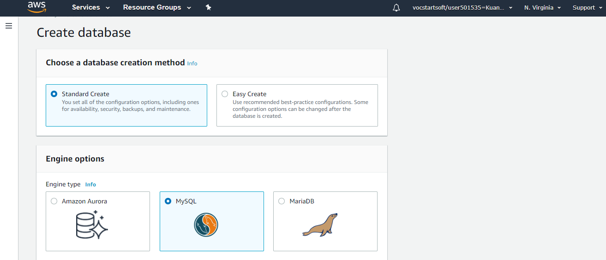
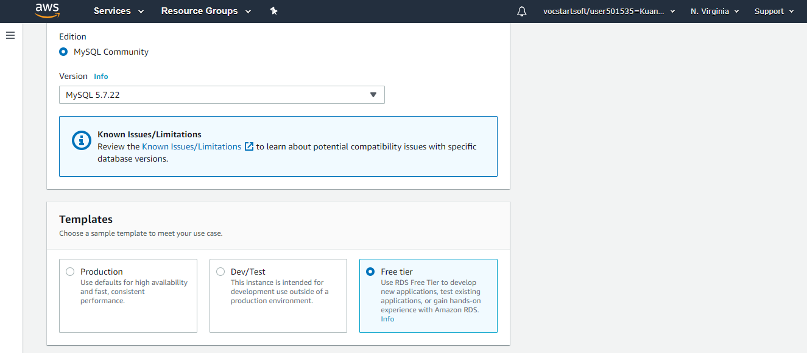

# Access AWS Database by Python
 In this project we are going to write script on Python to access, create table and print values.
 This is going to done in 2 main steps.

## **1 step. Creating Database on AWS**
 We choose RDS *(Relational Database Service)* on Services Menu

 

### Then Button **Create database**. We will click on **Standard Create**.
### In this project we use **MySQL** engine.

 

### **Edition** and **version** of MySQL we leave as default.

### Very important to choose **Free tier** template.  

  

### In **Settings** following properties are very essential:
   - **Endpoint** (this is the hostname)
   - **Port** (by default 3306)
   - **Database name** (ebdb)
   - **Username**
   - **Password**
   
### These configurations we are going to use to access our Database on Python.
